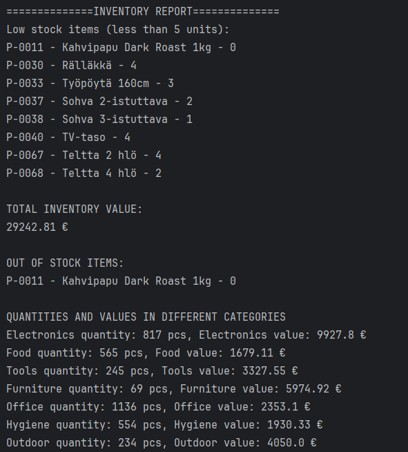

# Inventory reader

## Description / Kuvaus
English:
Inventory Report is a Python program that reads product data from a JSON file and generates a clear warehouse summary.
The program displays low‑stock items, out‑of‑stock items, the total inventory value, and category‑based quantities and values.
The JSON dataset used in this project was generated with AI (Microsoft Copilot) specifically for this implementation.

### Suomi:
Inventory Report on Python‑ohjelma, joka lukee tuotteet JSON‑tiedostosta ja muodostaa selkeän varastoraportin.
Ohjelma näyttää vähissä olevat tuotteet, loppuneet tuotteet, varaston kokonaisarvon sekä kategoriakohtaiset määrät ja arvot.
Tässä projektissa käytetty JSON‑data on generoitu tekoälyllä (Microsoft Copilot) tätä toteutusta varten.

## Installation & Usage / Asennus ja käyttö
### English:
Clone or download the project.

Ensure the JSON file is saved in UTF‑8 encoding.

Run the program using Python:
python inventory_report.py

The program will print a full warehouse report to the terminal.

### Suomi:
Lataa tai kloonaa projekti.

Varmista, että JSON‑tiedosto on tallennettu UTF‑8‑muodossa.

Suorita ohjelma Pythonilla:
python inventory_report.py

Ohjelma tulostaa varastoraportin terminaaliin.

## Example Output / Esimerkkituloste

