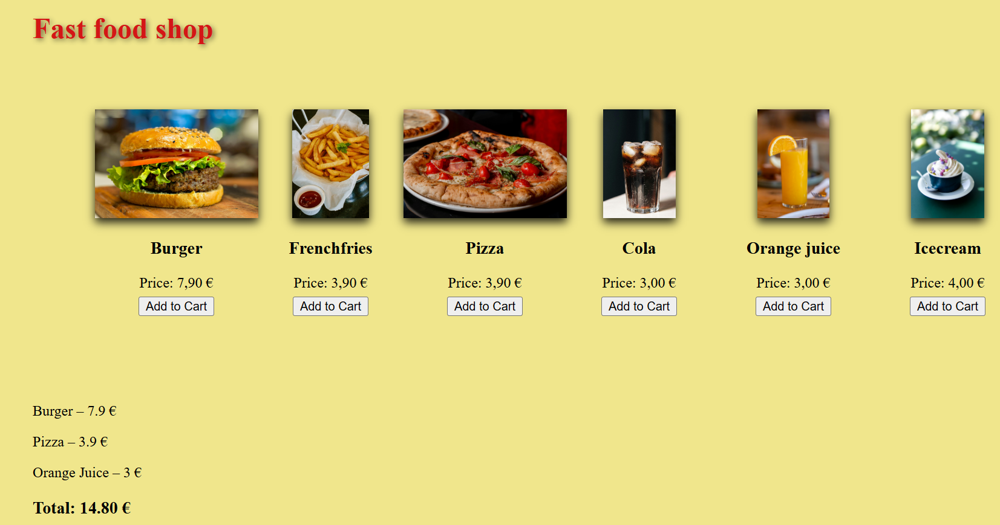

# Fast Food Shop / Pikaruokakauppa

## Overview / Yleiskuva

### English
This project is a simple fast‑food shop interface built with HTML, CSS, and JavaScript.
The main goal was to practice DOM manipulation, event listeners, and dynamic data handling by creating a functional shopping cart system.

The application displays a list of products, each with an “Add to Cart” button. When a product is added, the cart updates in real time and shows the total price.

### Purpose of the Project
This project was created as a personal learning exercise.
I wanted to understand how to:
-handle multiple buttons dynamically
-use JavaScript to update the DOM
-store data in arrays
-work with data-* attributes
-connect UI elements to JavaScript logic

These concepts had not yet been covered in my studies, so this project allowed me to explore them independently.

### AI Assistance
I used Microsoft Copilot as a learning aid during this project.
Some parts were new to me — such as handling multiple buttons, using class selectors on the JavaScript side, working with data-id values, and reading them through the dataset property.
Copilot helped me understand these techniques, and I implemented the final code myself.

### Suomi
Projektin tarkoitus
Tein tämän projektin harjoitustyönä, jotta pääsisin kokeilemaan ja opettelemaan uusia JavaScript‑tekniikoita käytännössä.
Halusin oppia:
-käsittelemään useita nappeja dynaamisesti
-päivittämään DOM‑rakennetta JavaScriptillä
-tallentamaan dataa arrayhin
-hyödyntämään HTML‑elementteihin tallennettuja data‑arvoja (data-id)
-yhdistämään käyttöliittymän elementit JavaScript‑logiikkaan

Näitä aiheita ei ole vielä käsitelty opinnoissani, joten projekti antoi mahdollisuuden harjoitella niitä itsenäisesti.

### AI‑apu
Käytin Microsoft Copilotia oppimisen tukena projektin aikana.
Osa asioista oli minulle uusia — kuten useiden nappien käsittely, class‑valitsimien hyödyntäminen JS-puolella, data-id‑arvot ja niiden lukeminen dataset ominaisuudella.
Copilot auttoi ymmärtämään nämä tekniikat, ja toteutin lopullisen koodin itse.

### FastFoodShop – UI preview

