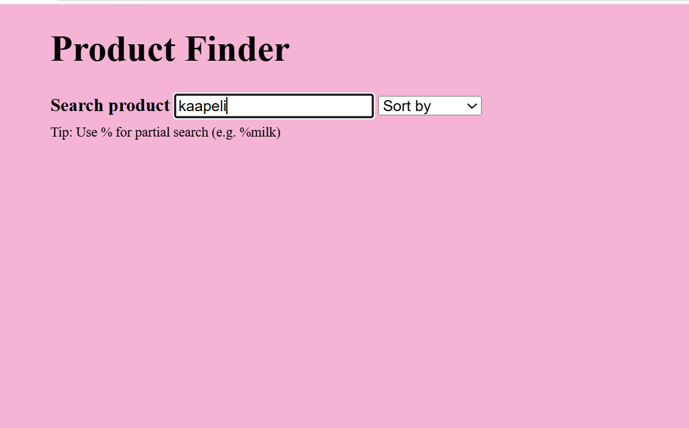
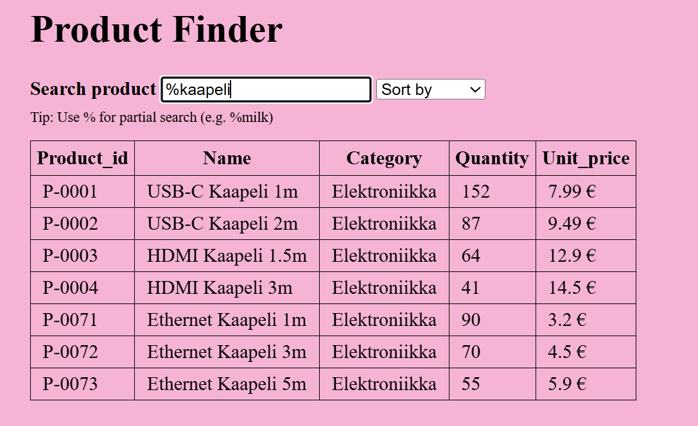

# Description / Kuvaus
## English
Product Finder is a JavaScript‑based web application that loads product data from a JSON file and displays it in a dynamic, sortable, and filterable table.
Users can:

search products by name

use % to perform partial searches (e.g., %milk)

sort products alphabetically (A–Z or Z–A)

view all product details in a clean, auto‑generated table

The JSON dataset used in this project was generated with AI (Microsoft Copilot) specifically for this exercise.

## Suomi
Product Finder on JavaScript‑pohjainen web‑sovellus, joka lukee tuotteet JSON‑tiedostosta ja näyttää ne dynaamisessa, järjestettävässä ja suodatettavassa taulukossa.
Käyttäjä voi:

hakea tuotteita nimen perusteella

käyttää %‑merkkiä osittaishakuun (esim. %milk)

järjestää tuotteet aakkosjärjestykseen (A–Z tai Z–A)

tarkastella kaikkia tuotetietoja automaattisesti luodussa taulukossa

Tässä projektissa käytetty JSON‑data on generoitu tekoälyllä (Microsoft Copilot) tätä harjoitusta varten.

## Features / Ominaisuudet
### English
Dynamic table creation using JavaScript

Live search with instant filtering

Partial search using % prefix

Sorting options (A–Z, Z–A)

Automatic formatting for price values

Clean and simple UI with custom CSS

### Suomi
Dynaaminen taulukon luonti JavaScriptillä

Reaaliaikainen haku

Osittaishaku %‑merkillä

Järjestäminen (A–Z, Z–A)

Automaattinen hinnan muotoilu

Selkeä ja yksinkertainen käyttöliittymä omalla CSS‑tyylillä

## Installation & Usage / Asennus ja käyttö
### English
Clone or download the project.

Ensure the JSON file (warehouse.json) is saved in UTF‑8 encoding.

Open index.html in a browser.

The product table will load automatically, and search/sort features are immediately usable.

### Suomi
Lataa tai kloonaa projekti.

Varmista, että JSON‑tiedosto (warehouse.json) on tallennettu UTF‑8‑muodossa.

Avaa index.html selaimessa.

Tuotetaulukko latautuu automaattisesti, ja haku/järjestäminen toimii heti.

## Search Logic / Hakulogiikka
### English
The search bar supports two modes:

Normal search:  
Matches products whose names start with the typed text.
Example: typing co matches coffee, cookies, etc.

Partial search using %:  
If the search term starts with %, the program performs a substring search.
Example: %milk matches almond milk, milk chocolate, etc.

### Suomi
Hakukenttä tukee kahta hakutapaa:

Normaali haku:  
Etsii tuotteita, joiden nimi alkaa kirjoitetulla tekstillä.
Esim. co löytää coffee, cookies jne.

Osittaishaku %‑merkillä:  
Jos hakutermi alkaa %‑merkillä, tehdään osahaku.
Esim. %milk löytää almond milk, milk chocolate jne.

## Sorting Logic / Järjestyslogiikka
### English
The dropdown menu allows sorting by:

Name (A–Z)

Name (Z–A)

Sorting is case‑insensitive and uses JavaScript’s built‑in .sort() method.

### Suomi
Valikosta voi järjestää tuotteet:

Nimi (A–Z)

Nimi (Z–A)

Järjestäminen on kirjainkoon suhteen riippumatonta ja perustuu JavaScriptin .sort()‑metodiin.

Technologies Used / Käytetyt teknologiat
HTML5

CSS3

JavaScript (ES6)

JSON dataset (AI‑generated)

## Folder Structure / Kansiot

Product Finder/
│── index.html
│── styles.css
│── script.js
│── warehouse.json
└── README.md

## Preview / Esikatselu
## Normal search

### Partial search (%)

